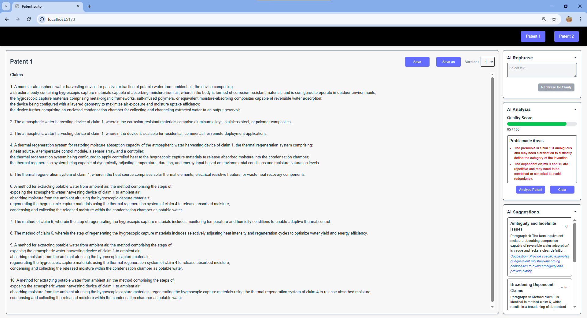

# Patent Editor AI

This repository cnotains a patent editor application (both server and client). This is based on the works of Solve Intelligence.
Following sections contains information on features and usage instructions 

## Features Overview

- **Document Versioning**:  
  Users can create new versions, switch between versions, and edit/save any version.

- **Real-Time AI Suggestions**:  
  WebSocket integration completed. The editor now streams AI suggestions in a side panel, sorted by severity (high, medium, low).

- **AI Rephrase**:  
  Highlight text and click on "Rephrase for Clarity" to get an AI-generated alternative wording.

- **AI Patent Analysis**:  
  Analyse the entire document to receive a score (0–100) and a list of potential issues that might trigger office actions.

---

## How to Run

1. Start the app using `docker-compose up --build`

2. Open the client at `http://localhost:5173`

Here is a snapshot of the UI..

#### Document Versioning

- Load `Patent 1` or `Patent 2` by clicking on the buttons in the top-right corner.

- After editing the document click on `Save` button to save the current version of the document to the DB.

- Click on `Save As` to save the content in a new version of the document.

- Switch between different versions of the document using the `versions drop down` on the top-right corner of the editor. Switching versions sets the selected version as the latest version so the latest version of the document is loaded when the patent is opened.

#### Real-Time AI Suggestions

Start typing in the editor. Suggestions will appear in the sidebar automatically in the "AI Suggestion" section. Suggestions are sorted based on their severity.

#### AI Rephrase

Highlight a claim in the patent and Click on `Rephrase for Clarity` button in the AI Rephrase section to get an alternate phrasing following the common rules of patent document. An option is provided to approve or reject the alternate phrasing.

#### AI Patent Analysis

Open the AI Analysis panel. Click `Analyse Patent` to generate a score based on the common practice of patents along with a list of problematic areas in the document that could potentially result in further office actions or even patent rejection.

### Credits

This application is based on the works of Solve Intelligence. Check them out!

### Contact

Please email `mohanselvan.r.5814@gmail.com` to collaborate, or if you have any queries!