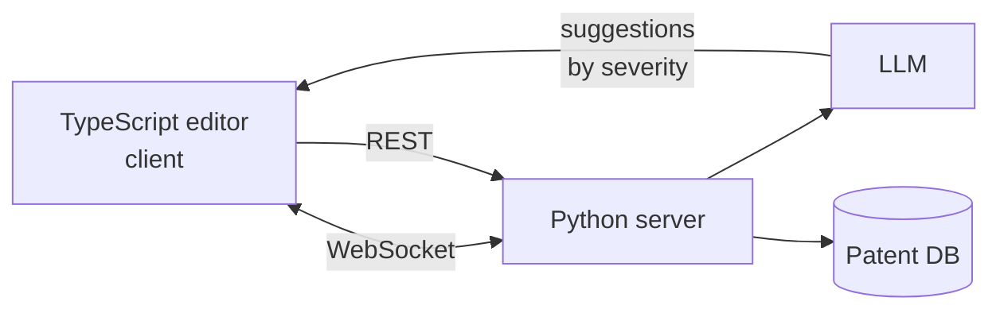

# AI-Assisted Patent Editor

A full-stack patent drafting editor where an LLM streams real-time suggestions, rephrases claims, and scores the document for office-action risk. Built as a study in **human-in-the-loop LLM UX** for high-precision, high-stakes writing.

## TL;DR

Patent drafting is expensive, slow, and unforgiving: a single sloppy claim can invalidate the whole application. This project explores what happens when you give the drafter an **LLM co-pilot in the editor itself** - not a chat window beside the document, but suggestions streamed live into the writing surface, tagged by severity.

Core loop: type, see AI suggestions appear sorted by severity (high/medium/low), accept or reject, repeat. Trigger a full-document analysis to get a 0-100 quality score and a list of potential office-action triggers.

## Why this problem

The project is a specific case of a general question I care about:

> How should an LLM expose its confidence and rationale inside a workflow where the human is legally accountable for the output?

Patent law is the hardest version of this question because:

- Every word has legal weight. Small rephrasings change claim scope.
- Humans sign off on the final document. The LLM is advisory, never authoritative.
- Mistakes surface slowly (months later, in office actions). The feedback loop is terrible.

The editor is my attempt to make the LLM visibly advisory, with explicit severity tags so the drafter can triage rather than read every suggestion.

## Features

### Document versioning
Create new versions, switch between versions, edit and save any version. Switching versions sets that version as the latest, which is what gets loaded next time.

### Real-time AI suggestions
WebSocket streams suggestions into a side panel as you type, sorted by severity. Suggestions are tagged as:

- **High** - likely to trigger office actions or invalidate a claim.
- **Medium** - style or clarity issues that weaken the patent.
- **Low** - minor phrasing notes.

### AI rephrase
Highlight a claim, click "Rephrase for Clarity", and the LLM returns an alternate phrasing that follows common patent conventions. Approve or reject inline.

### AI patent analysis
Run a full-document analysis. Returns:

- A 0-100 quality score.
- A list of potential issues that could trigger office actions or rejection.

## Architecture



UI snapshot:


## Tech

Python (backend) - TypeScript (frontend) - React - Postgres - WebSockets - LLM API - Docker Compose

## Repo tour

```
.
├── client/                 # TypeScript + React editor
├── server/                 # Python backend, WebSocket, LLM calls
├── docker-compose.yml
├── snapshot.png
├── LICENSE                 # Apache 2.0
└── README.md
```

## Run it

1. `docker-compose up --build` from the repo root.
2. Open the client at `http://localhost:5173`.

### Using the editor

**Document versioning**
- Load `Patent 1` or `Patent 2` via the top-right buttons.
- Edit and click `Save` to overwrite the current version.
- Click `Save As` to persist as a new version.
- Use the versions dropdown (top-right) to switch.

**Real-time AI suggestions**
- Start typing. Suggestions appear automatically in the sidebar under "AI Suggestion", sorted by severity.

**AI rephrase**
- Highlight a claim and click `Rephrase for Clarity`.
- Accept or reject the alternate phrasing.

**AI patent analysis**
- Open the AI Analysis panel and click `Analyse Patent`.
- Review the score and flagged issues.

## Where this could go

- Calibrate severity labels against historical office-action data (does a "high" suggestion predict actual rejection?).
- Add a "why" panel for each suggestion: the LLM's rationale and which section of which patent guideline it's applying.
- Eval harness that compares LLM suggestions against a held-out set of attorney-reviewed claims.

## Attribution

Based on the works of Solve Intelligence. Check them out!

## Contact

mohanselvan.r.5814@gmail.com
